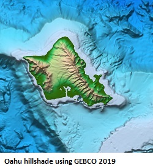

# The Gridfour Software Project
Tools for raster data including scientific and geophysical applications.

## Background

Although there many tools for image processing and gridded-data applications,
the Gridfour Project believes that there is still
a need for general-purpose software utilities for the processing of raster (grid)
products. Potential applications in these areas run the gamut from rendering,
data compression, contouring, surface analysis, and other operations aimed
at analyzing and understanding data stored in raster form.

## Our Inspiration
Recently, there has been a lot of news about the [Seabed 2030 Project](https://seabed2030.gebco.net/) . That ambitious
undertaking aims to map 100 percent of the ocean floor by 2030.  To put that in perspective,
the project organizers estimate that, today, only about 20 percent of the world's oceans are fully
mapped &#40;see [Seabed 2030, FAQ](https://seabed2030.gebco.net/faq/#q4) &#41;.  So there's a lot of work to be done
in the next decade.

On thing is certain, the existence of projects like Seabed 2030 will result in massive collections
of grid-based (raster) data sets.  Seabed 2030 itself will include about 7.6 billion grid points [&lsqb;1&rsqb;](#note1).
There is a need for software libraries that can assist in
the processing of that data. In particular, we see a need for more efficient techniques for storage
and data compression for grid data.  That need inspired us to create Gridfour.

## An Old Idea Made New
The first module created for the Gridfour Software Project is the G93 grid-based data
compression and file management module.  Gridfour's G93 API helps Java applications
manage raster (grid) data in situations where the size of the data exceeds what
could reasonably be kept in memory. It also provides a file-based utility for
the persistent storage of data between runs. And, finally, it includes custom
data compression that significantly reduces the storage size required for
raster data. 

The algorithms used in G93 have been around for a long time
They were originally developed for a project named Gem93 that was
completed in 1993 (we've named our file format "G93" in its honor).  Gem93 included 
a number of tools for working with raster data, among them a data compression technique
inspired by the work of Kidner and Smith (1992). You can read more about them at our wiki page
[G93 Compression Algorithms](https://github.com/gwlucastrig/gridfour/wiki/G93-Compression-Algorithms).

Of course, the state of the art has advanced quite a bit since 1993. And although
the Gridfour is based on old ideas, we hope that our G93 library will provide
a convenient tool for investigators developing new techniques for compressing
geophysical and scientific data in raster form.  G93 makes it very easy to
extend the Gridfour code and add new data compression capabilities &#40; to see
just how easy it is, visit our wiki page on
[Custom Data Compressors](https://github.com/gwlucastrig/gridfour/wiki/How-to-Register-a-Custom-Data-Compressor) &#41;.
Our hope is that by providing this tool, investigators will be able to
focus on their own research and leave the details of file-management to
the G93 tools.

### Help Wanted ###
We are finishing up the initial implementation of G93.  We are looking for
developers interested in porting it to additional languages
(such as C#, C++, Rust) and creating Python bindings. We are also looking for
users with ideas for new features and how to apply the library. 

## Things to Come  
The Gridfour Software Project is still in its infancy.  There is a lot
of opportunity for new ideas and new software development. In the future
we hope to include implementations of contouring, statistical analysis,
and physical modeling logic to our collection. We are also building tools to
simplify access to data from the Shuttle Radar Topography Mission &#40; [SRTM](https://www2.jpl.nasa.gov/srtm/) &#41;
and the U.S. Geological Survey's high-resolution National Elevation Dataset
&#40; [NED](https://catalog.data.gov/dataset/usgs-national-elevation-dataset-ned) &#41;.

In the meantime, you are welcome to visit our companion Tinfour Software Project at https://github.com/gwlucastrig/Tinfour

Finally, we end with a picture that was created using G93 and a set of elevation
and bathymetry data taken from the GEBCO_2019 global data set.  The picture
shows a view of the Island of Hokkaido, Japan. 
GEBCO_2019 was one of the data sets used for the G93 pilot project and a good example of the
potential of systems like it.  Color-coding was based on elevation obtained from a G93 file
and shading was computed using the surface normal obtained with Gridfour's B-Spline raster interpolation class.
The G93 data compression reduces the size of this data set down to about 17.2 percent of
its original size &#40;see [G93 Performance](https://github.com/gwlucastrig/gridfour/wiki/G93-Performance)
for more details &#41;. Future work may bring about more improvements.

## References
General Bathymetric Chart of the Oceans [GEBCO], 2019. _GEBCO Gridded Bathymetry Data_.
Accessed December 2019 from [https://www.gebco.net/data_and_products/gridded_bathymetry_data/](https://www.gebco.net/data_and_products/gridded_bathymetry_data/)

Kidner, D.B. and Smith, D.H. (1992). _Compression of digital elevation models by Huffman coding_,
Computers and Geosciences, 18(8), 1013-1034.

National Oceanographic and Atmospheric Administration [NOAA], 2019.
_ETOPO1 Global Relief Model_. Accessed December 2019 from [https://www.ngdc.noaa.gov/mgg/global/](https://www.ngdc.noaa.gov/mgg/global/)

## Notes
<a name="note1">&lsqb;1&rsqb;</a>Point count estimated using survey-resolution table given in 
[Seabed 2030, FAQ](https://seabed2030.gebco.net/faq/#q5). 
