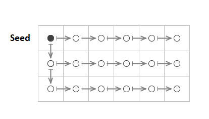

 
# Introduction
This document provides details on the design, methods, and algorithms used
by the Gridfour raster (grid) data compression implementation.

One of the goals for the Gridfour software is to provide a testbed for developers who are investigating
data-compression techniques for grid-based data. To that end, the Gridfour API
includes an implementation of a file format named G93 which provides a file-based
system for storing gridded data. Gridfour supports compression through the use of
custom _codec_ (coder-decoder) classes that are included in its software
distribution. These codecs may be used through the G93 file API or in stand-alone mode
depending on the requirements of the applications that use them.  Developers may
also leverage the Gridfour API to write their own custom codecs. 
To illustrate how a compression codec could be implemented, Gridfour provides codecs based on the well-known
Huffman coding (Huffman, 1952) and Deflate algorithms (Deutsch, 1996).  

The Gridfour implementations provide moderate data compression with good
access speed, but there is certainly room for improvement.
The algorithms used in the current G93 file management software are based on work that
was conducted in 1993 for a project called Gem93 (the name "G93" was chosen as a tribute to that work).
Clearly, the state of the art has advanced since that time. Many interesting techniques
that could be applied to compressing raster data are now available. The information
in this document is presented with the hope that it will assist researchers and
developers in their own efforts to find newer and even more effective data
compression techniques for raster data sets.

## G93 Data Formats
The G93 API supports 3 different formats for storing data:
1.  Integer
2.  Float
3.  Integer-Coded Float

The integer and float formats are both based on the fundamental data types used
by contemporary hardware and software systems. Both require 4 bytes. Floating point
data is stored using the IEEE-754 standard. 

The integer-coded float format converts floating point values to the integer format
by multiplying it by a scaling factor and adding an offset. This format
can discard some of the precision of the input float values (depending on
the scaling factor and the precision of the input data).  So it is, in
effect, a lossy representation. But, because the integer-coded float approach
is used for a number of publically available geophysical data sets, the G93 API
implements logic to support it directly.

The G93 API implements lossless (non-lossy) data compression algorithms for both 
integer and floating-point data.  The implementations for the two are much different.
In particular, the floating-point data compression does not take advantage of
the predictor methods described below. In general, floating-point data tends
to be less readily compressed than integer data.  This fact is sometimes a motivation
for using integer-coded float formats for data storage.   

## The ETOPO1 Example Data Set
The discussion that follows uses a data set called ETOPO1 to illustrate key points
related to raster data compression. ETOPO1 is a global-scale elevation and ocean depth
(bathymetry) data set provided on a grid defined by latitude and longitude coordinates.
Data is given at a uniform angular spacing of 1 minute of arc. The grid is organized
into 10800 rows and 21600 columns and provides over 233 million data points.
Elevations are given in the range -10803 meters (below mean sea level)
to 8333 meters (above mean sea level). ETOPO1 was selected
as an example for a number of reasons. First, it contains
a substantial number of sample points and requires enough storage space to be
interesting to compress. Second, the surface it describes is highly variable
and provides a broad spectrum of test cases ranging from flat plains,
to mountainous regions, to sheer drop offs along the continental shelf.
And, finally, terrain data is something that is familiar to our readers
and easily visualized.

It should, however, be noted that G93 is intended to be a general-purpose utility
for processing many different kinds of grid-based data sets. It is not limited
to geographic or geophysical information and is certainly not limited to
Digital Elevation Models (DEMs). The choice of ETOPO1 was a matter of convenience
as much as anything else.

## Tiling Schemes and Data Compression
The grid specification for many raster data files is large enough that it is often
impractical to store the entire content in memory. Even with a relatively compact
representation using short integers, the ETOPO1 data set would require close to
500 megabytes of memory. So the G93 File format partitions large rasters using a tiling
scheme. In a tiling scheme, the grid is divided into a series of regularly sized
subgrids as illustrated in the figure below.

 

From the perspective of data compression, the tiling scheme presents two influencial features.
First, because tiles must be accessed independently, they are compressed individually rather
than as a set. In G93, tiles are compressed on a case-by-case basis. This is significant because
in many data sets, the statistical properties of the data tends to vary across the
domain of the data. Data compression techniques thrive on redundancy and self-similarity
in the source data. But raster data sets with larger grids allow more room for variation
within the data. In the ETOPO1 elevation/bathymetry example, we would expect to see very
different terrain (and very different data compression characteristics) over the Nullarbor Plain
in Australia versus the steep drop offs along the Continental Shelf. By partitioning
a data set into separate tiles, we reduce the tendenacy for regions of data to be compressed
to include a large number of dissimilar features.

On the other hand, partitioning the data into smaller subgrids can have a disadvantage because
it reduces the overall size of a block of data to be compressed. Most practical compression
implementations include a certain amount of overhead beyond the storage required for the
actual data itself. This overhead tends to be of a more-or-less fixed size.For a small
data set, that overhead may comprise a significant amount of the overall storage required for
the data. But as the size of the data set increases, the relative contribution of the
overhead is reduced.

# Predictive Techniques for Raster Data Compression
Data compression techniques that work well for text are often ineffective for raster data sets.
Virtually all data compression algorithms operate by identifying redundant elements in a data set and
replacing them with a more compact representation. Unfortunately, many raster data sets,
particularly those containing geophysical information, tend to not present
redundancy in a form that conventional data compression tools can exploit.  Turning to the
elevation example cited above, it is easy to imagine a set of sample points collected
along a constant slope. Each elevation value in the set would be unique. So a superficial inspection
of the numeric values in the set would not reveal redundant elements.  But every sample would
reflect the same rate of increase from point to point. And the underlying structure of the data
would, in fact, carry a high degree of redundancy. The key to compressing such data
is to transform it into a state in which the redundant elements become visible to conventional
data compression techniques.  
  
Many raster compression techniques address the problem of non-compliant raster
data by using so called _predictive_ techniques. These techniques implement
models that predict the value at each grid point in the raster. The residuals
from these predictions (actual value minus predicted value), tend to be small
in magnitude and more readily compressed than the source data.  Thus, in its
compressed form, the data is represented using the prediction parameters
and the compressed residuals. During decompression, these residuals are
used as correction factors that adjust the predicted values to match the original inputs.

## The Simplest Predictive Technique
The original 1993 implementation used a simple predictor which assumed that the
value of the raster data remained constant from grid point to grid point.
For that predictor, the residual was just the value of the current grid
point minus that of its predecessor.  The compressed form of the raster
data consisted of an initial _seed_ value followed by a sequence of delta
values that could be used to recover the original representation.
In G93, this technique is referred to as a Differencing Predictor Model.
Other data compression implementations sometimes refer to it as a _differencing technique_.
In the original Gem93 project, the Differencing Predictor approach was inspired by
a description of audio delta pulse code modulation in
_The Data Compression Book_ (Nelson, 1991, p. 346). Delta pulse coding is a well-known
technique that was used in the audio industry as early as the 1950’s (Chaplin, 1952).
While the Differencing Model predictor is not especially powerful,
it is easy to implement and offers excellent run-time performance.

The Differencing Model predictor makes a critical assumption about the data. It assumes that
the values of two points closely located in space will tend to be similar.
In other words, it assumes that the _values_ of elements that are closely located
spatially (i.e. in terms of grid coordinates) will also be close together numerically.
And, thanks to this similarity (e.g. this tendency for neighboring samples to correlate),
it is possible to use the values of one or more grid points to predict
the value of a neighbor. This assumption is generally true in real-world examples
such as elevation data.  We expect that two points a few hundred meters
apart have a higher probably of being similar than two points placed
far apart in much different kinds of terrain.  This idea is sometimes referred
to as "spatial autocorrelation" and has been extensively studied in
Geographic Information Analysis and other fields.

Again let's consider the example of a set of elevation grid points specified on a
region with a constant slope. Because the sample points are collected at positions
with a uniform spacing, the difference in elevation from point-to-point is
constant or nearly constant. These differences are just the residuals from
the Differencing Predictor Model. They would exhibit a high degree of redundancy
and, thus, would compress to a highly compact form.

### Access Patterns for In-Memory Data
There are different ways we can construct a predictive model for raster data,
but all of them depend on being able to relate any particular sample
to its neighbors. When we consider the Differencing Predictor Model over a single
row of data in a grid, identifying neighbors is straight forward.
The relevant neighbor point is just the previous or next data point in the
sequence. But special handling is required when processing the transition
from the end of one row to the beginning of the next. If taken in sequence,
these two sample points will not be spatially correlated. 
 
In practice, this requirement for special handling is easily met. In the uncompressed form,
G93 stores grid points in row-major order (one row at a time). So in most cases,
the predecessor of a grid point is just the sample that preceded it in the row.
There is, however, one edge case that requires special handling. In row-major order,
the grid point that follows the last point in a row is the first point in the next row.
So, a predictor-residual based on the Differencing Model needs to implement
special handling for that transition. In G93, the following rules are applied:

1.	The first grid point in the first row of a tile is treated as a "seed" value.
2.	The difference value for each point in a row, except the first, is computed using the grid point that preceded it.
3.	The difference values for the first grid point in all rows (except the first row), are computed using the first value in the row that preceded it.

The figure below illustrates the pattern.  The seed value is shown as a solid dot,
the delta values are all shown as circles. The arrows indicate which samples are
paired together to compute delta values.

It is worth noting that the use of the Differencing Model for raster data is not unique to this project.
It is used in a number of specifications including the GRIB2 raster data format
(NCEP 2005, table 5.6) and the TIFF image format
(Adobe, 1992, p. 64, "Section 14: Differencing Predictor").

## Other Predictor Models
The current version of G93 implements two additional predictor models:
the Linear Predictor and the Triangle Predictor.

The Linear Predictor model predicts that the data varies as a linear function. The value
for the next sample in a sequence is predicted using a straight-line computed from the two
that preceded it.  The predictor is applied on a row-by-row basis. The vertical coordinate
of the points that precede the target point are assigned the values ZA, ZB respectively.
If we assume that the grid points are spaced at equal intervals,
then the predicted value, ZP, is given by ZP = 2xZB-ZA.

The Triangle Predictor was described by Kidner & Smith (1992).  It uses three neighboring
points A, B, and C, to predict the value of a target sample as shown in the figure below.
The vertical coordinate of the points are assigned the values ZA, ZB, and ZC respectively. 
By treating the grid as having a fixed spacing between columns, _s_, and a fixed spacing between rows, _t_,
the prediction computation is simplified to ZP = ZB+ZC-ZA.

To see how this relationship is derived, start by taking each sample and the predicted
point as vectors:

 

From linear algebra, we can compute the normal to a plane and locate a point on that plane
using the following:

 

When we solve for ZP, the _x_, _y_, _s_, and _t_ variables cancel out and we find
the simple computation used by the Triangle Predictor model.

Both the Linear and the Triangle Predictor require special handling to initialize
the grid before applying the prediction computations. In the case of the Linear
Predictor, G93 uses the seed value and the pattern established for the Differencing
Predictor to pre-populate the first two columns of the grid. In the case of the
Triangle Predictor, the first row and first column are populated using same approach.
Once the grid is initialized, the specific predictors
can be used for the remaining grid cells.

## Serializing the Residuals
Once the residuals are computed using a predictor-residual model,
they are passed to compression processes based on conventional data
compression algorithms such as the Huffman and Deflate techniques
described above.  Both the custom Huffman implementation included with the G93 code base
and the Deflate API provided as part of the standard Java library
are designed to process bytes. But the predictive-residual models produce output
in the form of integers. So in order to use them to process
and store the outputs from the models, the residuals must somehow be serialized
into a byte form. Most of the residuals tend to be close to zero, so the serialization
for them is trivial. In some cases, however, the residuals will be in
excess of the value that can be stored in a single byte.

While it would be feasible to simply split out the integer residual
values into the component bytes, doing so would tend to dilute the
redundancy in the output data. Furthermore, a significant number
of the residuals are quite small (using the Triangle Predictor, 87.9 percent
of the residuals computed for ETOPO1 have an absolute value less than 15).
So using 4 bytes to store these small values would be wasteful.

To serialize the residuals, G93 uses a scheme that it calls the M32 code.
M32 is an integer-to-byte coding scheme that adjusts the number of bytes
in the output to reflect the magnitude of each term in the input.
In that regard, it uses an approach similar to that used for the widely used UTF-8 character encoding.
As in the case of UTF-8, the first byte in the sequence
can represent either a literal value or a format-indicator that
specifies the number of bytes to follow. M32 also resembles the
variable-length integer code used by SQLite4 (SQLite4, 2019), except that
it supports negative values as well as positive. The first byte
in the output is essentially a hybrid value. For small-magnitude values (
in the range -126 to +125), it is just a signed-byte representation
of the input value. The remaining values &mdash; 126, 127, and -127 and &mdash;
are used to indicate sequences of length 2, 3, and 4 bytes, respectively.
The value -128 is used to indicate the null-data code (-2147483648).
For the multi-byte sequences, the bytes that follow the introducer are
simply the bytes extracted from the values given in big-endian order.

The M32 coding scheme is effective in the case where the computed residuals
tend to be small because it preserves the one-byte-per-value relationship.
In the case of larger residuals, the M32 code can actually be longer
than 4 bytes. Fortunately, in the elevation data sets used when developing
G93, the residuals tended to be small. For example, in the case of the ETOPO1
data set, the average length of the M32 code sequences is
about 1.013 bytes per grid value.

# Compressors
By applying the predictive-residual transformations and M32 serialization,
the G93 codecs transform the data to a state where it can be processed by
convention compressor methods. While the transformation-serialization process generally
reduces the size of the data (as it did for the ETOPO1 example),
its main benefit is that it results in a form with more
redundancy than the original. And as the redundancy is increased,
the data becomes more suitable for processing by conventional data compression techniques.

As noted above, the two codecs currently implemented in G93 are based
on the Huffman coding and Deflate algorithms. API’s that support
Deflate are available in most popular software environments and
programming languages. G93 uses the Deflate class provided by
the standard Java API.  For the simpler Huffman coding,
G93 uses a custom implementation.

During the compression phase, the current implementation of G93 attempts
to compress data using both codecs and all three predictive-residual transformations.
It then selects the serialized form that produces the smallest output size.
In testing with ETOPO1, the Deflate algorithm was selected in
about 65 percent of the tiles with Huffman being selected for the remaining 35.

## Huffman Coding
Huffman coding was originally developed for the compression of text-based data
and the terminology associated with it reflects that origin. For these notes,
we will stick to the usual conventions and refer to the sequence of data values
to be compressed (the M32 serialized bytes) as the "text". Individual elements
with the sequence (each M32-serialized byte) will be described as the _symbols_.

Huffman coding is based on an analysis of the frequency with which certain
data values (symbols) appear within the data sequence (text) to be compressed.
It provides an efficient way of assigning a unique sequence of bits
to each symbol such that the more common symbols have shorter encoding
sequences and the less common symbols have longer sequences.
Since common symbols can be encoded using short sequences,
the overall length of the encoded text is reduced.

One consequence of this approach is that the encoded message must somehow
carry information about the _frequency table_ for the symbols it encodes.
Traditional Huffman implementations provide this information directly
by including a symbol-frequency table at the start of the compressed
data sequence. Adaptive Huffman methods embed the information
in the compressed sequence itself. In either case, the frequency
information adds overhead to the encoded data.

In many cases, the overhead for the frequency information has a fixed size regardless
of the length of the encoded text. Thus, as the length of the
original text increases, the proportion of the output due to
overhead elements decreases. So, under the Huffman encoding,
longer text tends to compress more efficiently than shorter text.

On the other hand, in some data sets, the distribution of the symbol frequencies
can change over the course of the text. For example, in the ETOPO1
elevation data, the symbol table for a mountainous region behaves differently
than that collected over the plains. So if a set of elevation data set
contained data for both regions, a single frequency table would not provide
an efficient description the two separate regions. In spatial analysis,
this tendency of the statistical properties of data to change across
a data set is referred to as _non-stationarity_.

These two considerations have a direct bearing on the size of the tiles specified
when creation a G93 file to cover a raster product with non-uniform behavior.
A larger tile size reduces the amount of symbol-table overhead compared
to the length of the encoded data. But a larger tile also allows
for more non-stationarity and thus dilutes the effectiveness of
the symbol table.  Of course, a larger tile size also increases
the memory use by the application.  So finding an optimal tile-size
choice may require some experimentation. In working with elevation data sets,
we have found that a tile size in the range of 10 to 40 thousand grid
cells tends is usually a good place to start.

### How G93 Stores the Huffman Tree
In the classic Huffman algorithm, the symbol-frequency table is used to create
a tree structure that serves as a mechanism for encoding or decoding
the compressed data. Although many implementations store the frequency data directly,
the G93 implementation gains efficiency by storing the structure of the tree itself
rather than retaining the actual frequency data.

In the storage phase of processing, the Huffman tree is created using
the classic algorithm. Once established, the tree is stored according
to the following recursive algorithm which starts from the
root node of the tree.

    1. Introduce with sequence with an unsigned byte indicating the number
       of unique symbols, N, in the tree. Since there will never be zero symbols
       in the tree, G93 stores the value N-1 in this byte. Thus one byte is sufficient
       to represent all possible symbol counts for a M32 representation.
    2. Traverse the Huffman tree starting from the root node using RecusiveStore(rootNode)
    3. RecursiveStore(node)
        a. If the node is a branch
            i. Output a bit with value 0.
            ii. Call RecursiveStore on the left child node.
            iii. Call RecursiveStore on the right child node.
            iv. Return.
        b. If the node is a leaf (a terminal)
            i. Output a bit with a value 1.
            ii. Output the symbol.
            iii. Return.

In testing with the ETOPO1 data set, there were typically about 100 unique
symbols in a M32-serialized tile. Storing the Huffman tree algorithm averaged
about 782 bits per tile.

For simplicity, the tree-encoding algorithm was described above using a
recursive approach. In the actual code, it is implemented using a stack.
Although the stack-based approach leads to more complicated code,
it is necessary because of the potential depth of recursion that
might be encountered when storing the tree structure. In rare cases,
the depth of the Huffman tree (and thus the depth of recursive calls)
could reach 256, which would be too deep for some Java JVM’s.
Thus a safe implementation required the use of a stack.

## Arithmetic Coding
Kidner and Smith (2003) demonstrated improvement in compression ratios by using
arithmetic coding rather than Huffman codes. Because arithmetic coding reflects
the frequency distribution of symbols in the compressed data more accurately than
Huffman, it can achieve better compression ratios than Huffman.
Unfortunately, implementing arithmetic coding is more complicated than
implementing Huffman coding.  Arithmetic also encoders tend to require
more processing time than Huffman.

As an experiment, we implemented a compression codes using the Reference Implementation
of an adaptive arithmetic encoder (Nayuki, 2020). During the test, we
replaced the Huffman codec with the arithmetic codec, but retained the Deflate codec.
The relative number of tiles for which arithmetic coding was selected remained roughly
the same as for the Huffman case described above. But the arithmetic encoder
reduced the size of the compressed data by about 2 percent. On the other hand,
arithmetic coding required more processing time than Huffman.

|  Method              |  Bits/Symbol   | Time to Read Tiles |
| -------------------- | -------------- | ------------------ |
| Huffman & Deflate    |  4.6           | 1.9                |
| Arithmetic & Deflate |  4.5           | 7.2                |

It is worth noting that the Reference Implementation focuses on correctness
of implementation and clarity of code, so lacks some optimizations that
would tend to complicate or obscure the logic. So, there may be opportunities
for reducing the processing time. Arithmetic coding may be the subject
of future investigation for the G93 project.  

# Future Work
The introduction to this wiki page made the claim that the G93 package is intended
to serve as a testbed for investigators and software developers who wish to
experiment with their own solutions for raster data compression. We hope that by
describing the current implementations, we demonstrated some of the reasons that
we think that claim is valid.

There are many, many promising avenues to explore for better solutions
to the raster data compression problem. Kidner and Smith (2003) used a more
power predictor based on Legrange multipliers and arithmetic coding.
Some commercial solutions (and the JPEG 2000 standard) have explored
the use of wavelet functions. Data compression continues to be an area
of active interest in the software community, and we fully expect that
new techniques are waiting to be discovered.

The G93 project is especially interested in lossless, or nearly lossless, techniques
for compressing real-valued data.  The current G93 implementation implements compression
for floating point data, but the results are not as successful as they are for integers.

If you are investigating raster-based data compression, we wish you the best
of luck and hope that insights from G93 can help you on your way. And, as always,
we welcome your ideas and suggestions.
  

# References
Adobe Systems, Inc. (1992). _TIFF Revision 6.0 Final – June 3, 1992_. Retrieved January 2020 from https://www.adobe.io/open/standards/TIFF.html

Cutler, C. Chapin. (1950). U.S. Patent No. 2605361, "Differential Quantization of Communication Signals". Filed June 29, 1950, issued July 29, 1952

Deutsch, L. Peter  (1996). "DEFLATE Compressed Data Format Specification version 1.3". IETF. p. 1. sec. Abstract. doi:10.17487/RFC1951. RFC 1951.

Huffman, D. (1952). "A Method for the Construction of Minimum-Redundancy Codes" (PDF). Proceedings of the IRE. 40 (9): 1098–1101. doi:10.1109/JRPROC.1952.273898.

Kidner, D.B. and Smith, D.H. (1992). "Compression of digital elevation models by Huffman coding". Computers and Geosciences, 18(8), 1013-1034.

Kidner, David B. & Smith, Derek, H. (2003). "Advances in data compression of digital elevation models". Computers & Geosciences 29 (8), 985-1002.

National Weather Service -- National Centers for Environmental Prediction [NCEP], 2005. "NCEP WMO GRIB2 Documentation". Accessed January 2020 from https://www.nco.ncep.noaa.gov/pmb/docs/grib2/grib2_doc/

Nayuki (2020). "Reference Arithmetic Coding". Retrieved January 2020 from https://www.nayuki.io/page/reference-arithmetic-coding

Nelson, M. (1991). _The Data Compression Book_. M&T Publishing Company, Redwood City, CA.

SQLite4 (2019). "Variable-Length Integers". Retrieved October 2019 from https://sqlite.org/src4/doc/trunk/www/varint.wiki.

Wikipedia (2020). "Differential pulse-code modulation". Retrieved January 2020 from https://en.wikipedia.org/wiki/Differential_pulse-code_modulation
